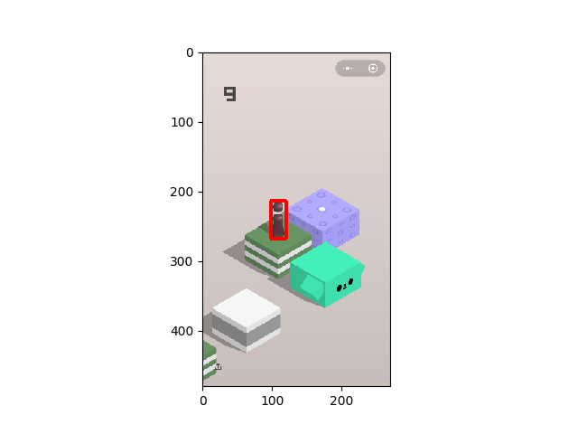

# WechatJump

This git is used for automatically playing of the wechat game jump and jump

Android phone only

android debug toolkit has to be installed first

```shell
apt-get install android-tools-adb
```


## two_click.py

This is the basic script to understand the program. User have to manually select point of the chess and then select the point of the target

## one_click.py

In this script, opencv is used to found the position of the chess using template matching


The program autmaticcaly load the template and draw a bounding box around the chess



## no_click.py

In this script, I adopt a strategy to found the position of the next center.

